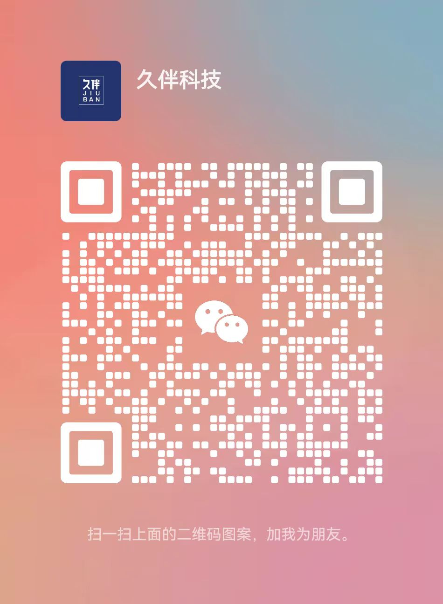

 
 

##  简介
本项目是一个物联网基础平台，可以快速实现硬件设备接入。

* Java 后端：`master` 分支为 JDK 8 + Spring Boot 2.7.18
* 管理后台的电脑端：Vue2 提供 `element-ui` 版本
* 后端采用 Spring Boot 多模块架构、MySQL + MyBatis Plus、Redis + Redisson，Vert.x
* 支持多租户模式
* 统一接口接收和返回格式，使用OpenApi 3+knife4j作为接口文档工具
* 时序数据库使用TDengine，可另行扩展
* 消息队列已经实现RocketMQ和基于vertx的eventbus，可以自行根据需要扩展使用其他中间件：Kafka、RabbitMQ等
* 实时通信使用websocket，基于vert.x框架实现
* 集成七牛云云存储服务，预留其他服务商接口，自行实现扩展

#### 其他
① 代码整洁、架构整洁，遵循《阿里巴巴 Java 开发手册》规范。

② 工具类只依赖Apache相关的，或简单自行编写，减少第三方依赖，避免高危漏洞。

3 统一接口接收和返回格式

#### 物联网项目 模块组成

##### protocol 协议层代码
- 1、base 协议基础抽取
- 2、service 实现协议组件，实现整个通讯通道、编解码，完成数据的流转。提供方法给业务层调用
- 3、tcp、http、ws、mqtt是具体协议的实现包

##### module 抽象出可以多实现方式的组件
- 1、oss 文件存储
- 2、notify 告警通知
- 3、sink 物模型数据落地到数据库

##### achieve 用来实现 module组件的
- 1、mq-vertx 用vert.x 来实现消息队列
- 2、rocket-mq rocketMq的实现
- 3、oss-qn 七牛实现存储方案
- 4、sink-td TDengine 对设备上报下发数据记录、设备的属性等数据量很大的场景
- 5、sink-mysql mysql 的方式实现数据落地

##### biz 业务层
- 1、base 工具类；基础枚举值、vo的定义；系统配置
- 2、service，具体的业务，抽离处理，可以供多端调用实现：web、openApi等
- 3、open-api 对第三方对接提供接口
- 3、test 测试代码
- 4、web web端的接口

#### 功能点：
- 1、支持mqtt、http、tcp、websocket等协议通道
- 2、实现物联网设备基本协议，实现新设备接入时候，可以利用插拔式的方式快速接入，新设备解析方式可以用js 或者python的方式快速实现，减少开发成本
- 3、实现设备属性和功能的自定义，快速实现设备的功能
- 4、websocket推送设备实时消息到页面
- 5、设备告警系统
- 6、记录操作日志和数据异动日志
- 7、用户权限等基础功能
- 8、open api接口开放

#### 其他
[演示地址](http://www.jiubankeji.cn/web_iot)

帐号/密码：
`18812345678` `Io@t0315Jb!`

**如有疑问或者需要源码的可以随时联系：**

(扫码或者直接搜索`jiubanyun_iot`添加微信)